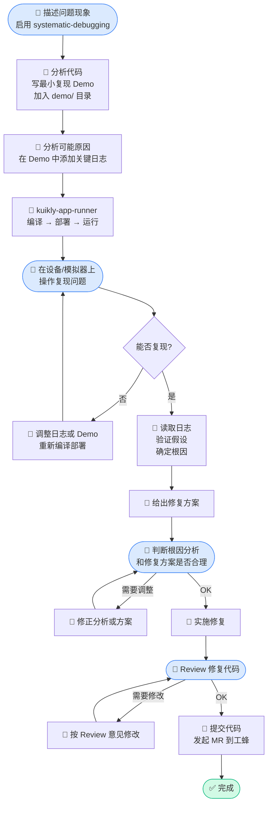

# Bug 跟进工作流

> 这份文档是团队成员操作指南，描述 AI 辅助 Bug 跟进的完整流程。
> **核心原则**：人只做 4 件事，其余全部由 AI 完成，无需打开 IDE。

---

## 整体流程图



**蓝色节点**：需要人工参与的步骤（共 4 步）

---

## 人工参与的 4 件事

| 步骤 | 你需要做什么 |
|------|------------|
| **1. 描述问题** | 描述现象（平台、复现步骤、预期 vs 实际），并注明 `/systematic-debugging` |
| **2. 操作复现** | 在设备/模拟器上按步骤操作，AI 没法点屏幕 |
| **3. 判断方案** | 确认 AI 的根因分析是否合理，修复方案是否 OK |
| **4. Review 代码** | 审查 AI 提交的修复代码 |

---

## 使用方式

### 启动 Bug 跟进

```
/systematic-debugging

问题描述：[平台] [现象]
复现步骤：
1. ...
2. ...
预期结果：...
实际结果：...
```

### AI 会自动

1. 分析相关代码，在 `demo/` 下创建最小复现 Demo（如 `demo/.../BugReproDemo.kt`）
2. 添加 `KLog` 诊断日志，调用 `/kuikly-app-runner` 编译部署
3. 等你复现后，读取 `./logs/` 下的日志，确认根因
4. 给出修复方案 → 实施 → 提交 → 发起工蜂 MR

### 发起 MR

AI 使用工蜂 MCP 工具发起 MR，不是 `gh pr create`：

```
mcp__gongfeng__create_merge_request
  project_id: <工蜂项目 ID>
  source_branch: <修复分支>
  target_branch: main
  title: "fix: ..."
```

> 如果 AI 不知道工蜂项目 ID，提示它执行 `mcp__gongfeng__search_projects` 查找。

---

## Demo 管理

- 复现 Demo 创建在 `demo/` 目录，文件名加 `BugRepro` 前缀
- 提交 MR 时 AI 会询问是否保留 Demo，通常不需要合入主干
- 如果 Demo 揭示了值得保留的典型用例，可以重命名后保留

---

## 所用 Skills

| Skill | 作用 |
|-------|------|
| `systematic-debugging` | 驱动系统性根因分析，防止 AI 直接猜测修复 |
| `kuikly-app-runner` | 编译、部署、运行 iOS/Android/HarmonyOS，捕获日志 |
